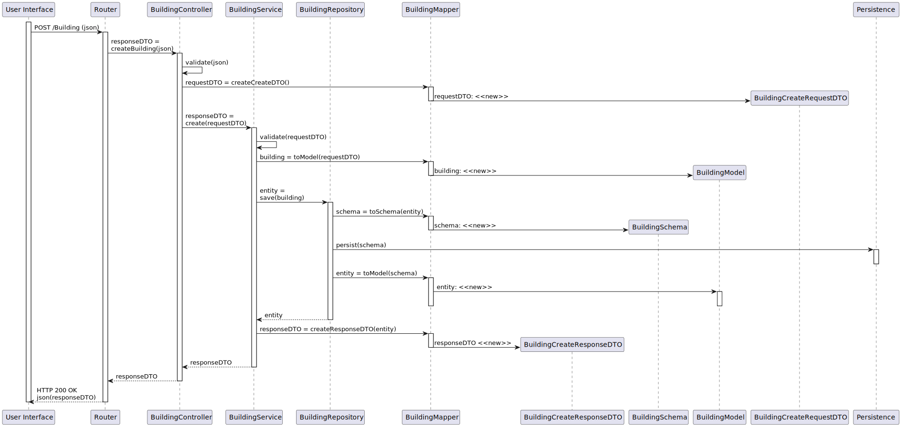

# UC 150 - Criar Edificio

## 1. Requirements
The **Campus Manager** starts the process of creating a new building by providing the system with the following information:
* Building name
* Building Code

#### Preconditions
* Campus Manager is authenticated.

#### Postconditions
* The information about the building is stored in the system.

## 2. Analysis

### 2.1. Information
[Source](https://moodle.isep.ipp.pt/mod/forum/discuss.php?d=25047#p31684)
* **Building code:** mandatory, max 5 chars (leters, numbers and space)
* **Building name:** optional, max 50 alfanumeric chars

### 2.2. Analysis

## 3. Design

### 3.1 Information

### 3.2 Views

### 3.3 Patterns/Libs

## Tests

### Integration Testing