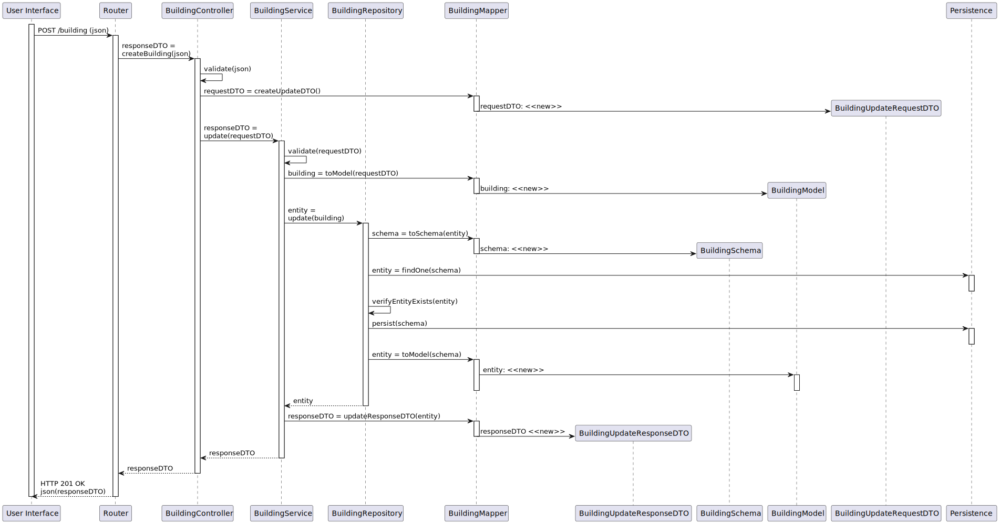

# UC 160 - Editar Edificio

## 1. Requirements

#### Preconditions
* Campus Manager is authenticated.
* The building must exist in the system.

#### Postconditions
* The information about the building is stored in the system.

## 2. Analysis

### 2.1. Information

### 2.2. Analysis

## 3. Design

### 3.1 Information

### 3.2 Views

### 3.3 Patterns/Libs

## Tests

### Integration Testing