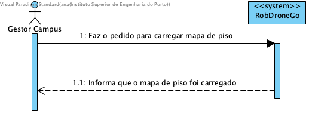
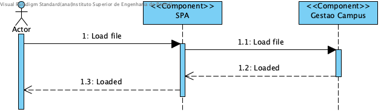
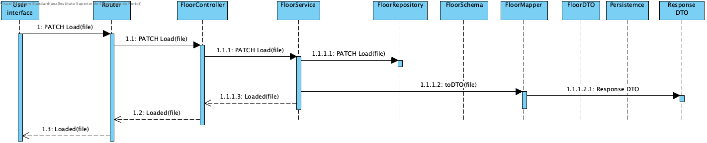

# UC 230- Carregar mapa piso
A JSON file with info abou floors, rooms, elevators and exits, should be loaded into the system.

## 1. Requirements

 [moodle](https://moodle.isep.ipp.pt/mod/forum/discuss.php?d=25150)
 [file](https://www.dei.isep.ipp.pt/~jpp/LAPR5/mazes/LAPR5.json)
 It must be a JSON file.

#### Preconditions
* Campus manager is authenticated.
* Buildings, floors, rooms and elevators already should exist in the system.

#### Postconditions
* The information about the buildings,floors,rooms and elevators is loaded and stored in the system.

## 2. Analysis

### 2.1. Information & analysis

- PATCH endpoint in path /api/file

## 3. Design

### 3.1 Information

### 3.2 Views

#### Level 1

#### Level 2

#### Level 3

### 3.3 Patterns/Libs

 - Aggregate root

 - Value object  

 - High cohesion and low coupling
   - By applying a layered architecture it was intended to organize the sections of the code with the best separation of responsibilities and with the lowest dependency between layers. 

- Information expert
  - The designed solution aims to assign the correct responsibility given the information the classes hold.

- Interface Segregation Principle

- Dependency Inversion Principle

- DTO pattern.

## Tests

### Unit

#### Repository
- validate isolated behaviour of repository functions with mocked schema in case of success

#### Service
- validate isolated behaviour of service functions with mocked repository in case of success
- validate isolated behaviour of service functions with mocked repository with bad arguments, check failure errors

#### Controller
- validate isolated behaviour of controller functions with mocked service in case of success and status code
- validate isolated behaviour of controller functions with mocked service with bad arguments, check failure errors and status code

### Integration Testing