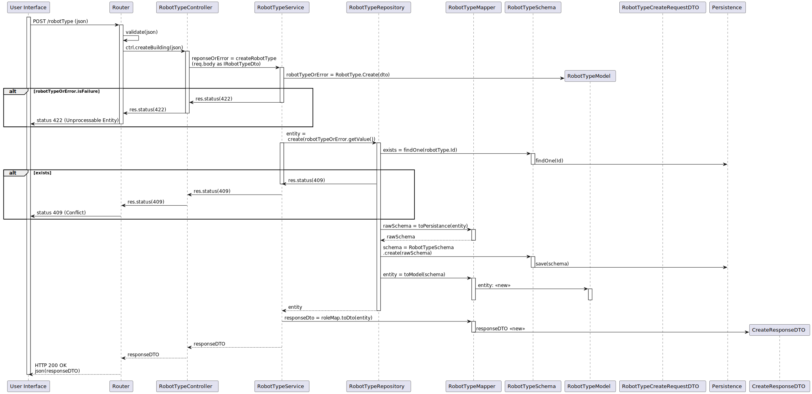

# UC 150 - Criar Edificio
*Como gestor de frota pretendo adicionar um novo tipo de robot indicando a sua designação e que tipos de tarefas pode executar da lista prédefinida de tarefas*

## 1. Requirements

- Model and brand are free text attributes - [Forum question](https://moodle.isep.ipp.pt/mod/forum/discuss.php?d=25367)

- Only two possible task types - [Forum question](https://moodle.isep.ipp.pt/mod/forum/discuss.php?d=25045#p31683):
    - Vigilancia: As tarefas de vigilância caracterizam-se por indicar qual o edificio e piso(s) que se pretende vigiar bem como o número de contacto em caso de incidente. tipicamente o segurança irá requisitar que um robot "dê uma volta pelos pisos X, Y e Z do edificio N". Caso o robot detete alguma situação anómala, o robot irá enviar um SMS para o contacto indicado (*)
    - As tarefas de "pickup & delivery" caracterizam-se por indicar qual a sala que se pretende de pickup e qual a sala de delivery, bem como um nome e um contacto para pickup e outro para delivery. deve também ser indicado um código de confirmação que a pessoa que receberá deverá introduzir no painel do robot. adicionalmente deve ser indicada uma descrição da entrega, ex., "Marcadores de cor vermelha (1x) e azul (2x)"

(*) fora do âmbito do protótipo

- Character limits [Forum question](https://moodle.isep.ipp.pt/mod/forum/discuss.php?d=25171):
    - tipo de robot: obrigatório, alfanum+ericos, maximo 25 caracteres
    - marca: obrigatório, maximo 50 caracteres
    - modelo: obrigatório, máximo 100 caracteres

#### Preconditions
* Fleet manager is authenticated.

#### Postconditions
* The information about the type of robot is stored in the system.

## 2. Analysis

### 2.1. Information & analysis

- POST endpoint in path /robotType
- Json body with the following information:
    ```
        {
            typeOfRobot: string
            brand: string
            model: string
            supportedTasks: List<string>
        }
    ```

## 3. Design

### 3.1 Information

### 3.2 Views


### 3.3 Patterns/Libs

## Tests

### Integration Testing