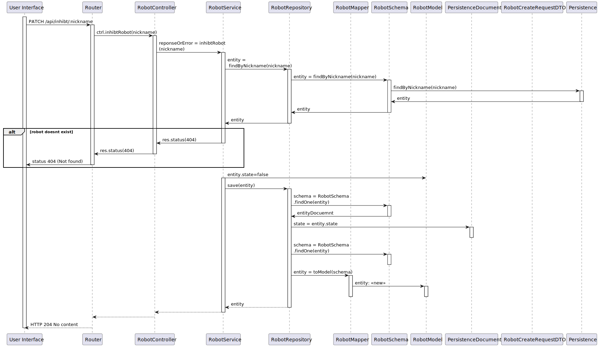

# UC 350 - Criar tipo de robot
*Como gestor de frota pretendo inibir um robot*

## 1. Requirements

- "ponto de vista funcional pretende-se que seja possivel inibir ou desinibr um robot e que essa informação seja devidamente utilizada nos restantes casos de uso. por exemplo, um robot inibido não pode executar tarefas."
[Forum question](https://moodle.isep.ipp.pt/mod/forum/discuss.php?d=25118):

#### Preconditions
* Fleet manager is authenticated.

#### Postconditions
* The information about the robot state is stored in the system.

- Endpoint should be a PATCH

## 2. Analysis

### 2.1. Information & analysis

- PATCH endpoint in path '/api/robots/inhibt/:nickname',
- Since this case will be a inhibit only endpoint, there is no need for a body

## 3. Design

### 3.1 Information

### 3.2 Views

#### Level 1

#### Level 2

#### Level 3

### 3.3 Patterns/Libs

 - Aggregate root

 - Value object  

 - High cohesion and low coupling
   - By applying a layered architecture it was intended to organize the sections of the code with the best separation of responsibilities and with the lowest dependency between layers. 

- Information expert
  - The designed solution aims to assign the correct responsibility given the information the classes hold.

- DTO pattern.

## Tests

### Unit

#### Service
- validate isolated behaviour of service functions with mocked repository in case of success
- validate isolated behaviour of service functions with mocked repository with bad arguments, check failure errors

#### Controller
- validate isolated behaviour of controller functions with mocked service in case of success and status code
- validate isolated behaviour of controller functions with mocked service with bad arguments, check failure errors and status code

### Integration Testing