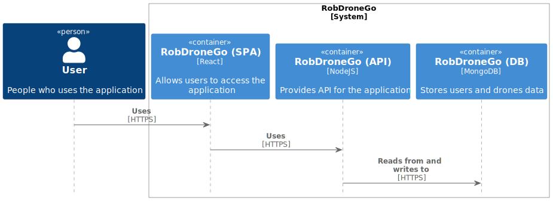
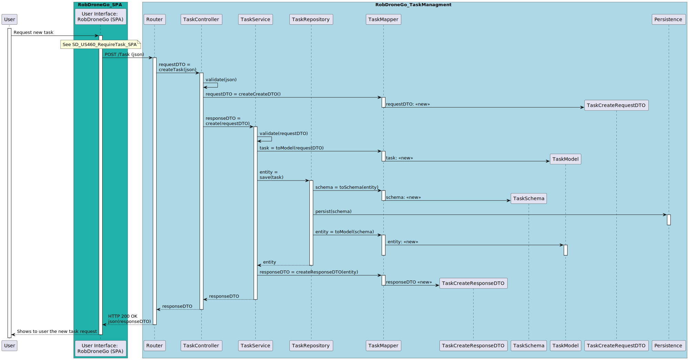
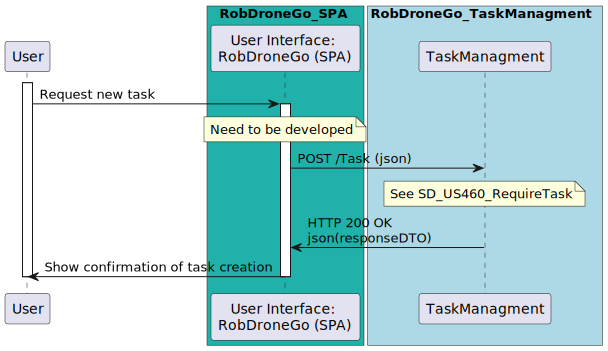

# US460 - Require Task

## 1. Requirements
The **User** starts the process of creating a new task.
Selects the type of task.
Provides the information required (see information below).
The system saves the requirement.

#### Preconditions
* User is authenticated.

#### Postconditions
* The information about the task requirement is stored in the system.

## 2. Analysis

### 2.1. Information

[Source](https://moodle.isep.ipp.pt/mod/forum/search.php?search=US460&id=5536&perpage=10&page=0)
* **Global**
  * Save the information of the person who requires the task
* **Vigilance Task**
  * Building Id
  * Floor Id
  * Emergency contact number (to text anomalies)
  * Consider a vigilance task by floor
* **Pickup & Delivery Task**
  * Pickup Room Id
  * Delivery Room Id
  * Delivery confirmation code (4 -6 digits)
  * Description of the delivery (limit to 1000 alfanumeric characters)

* **Initial Task Status**: PENDING
* **Task Status**: Pending, Approved, Rejected, InProgress, Completed, Cancelled

### 2.2. Analysis

## 3. Design

### 3.1 Information

### 3.2 Views
#### 3.2.1 Process View

#### 3.2.2 Sequence Diagram
#### Task Manager

#### SPA

### 3.3 Patterns/Libs

- DDD : Domain Driver

 - High cohesion and low coupling
   - By applying a layered architecture it was intended to organize the sections of the code with the best separation of responsibilities and with the lowest dependency between layers.

- Information expert
  - The designed solution aims to assign the correct responsibility given the information the classes hold.

- DTO pattern.

Frontend

- MVVM: Model, View, ViewModel

## Tests

### Integration Testing
